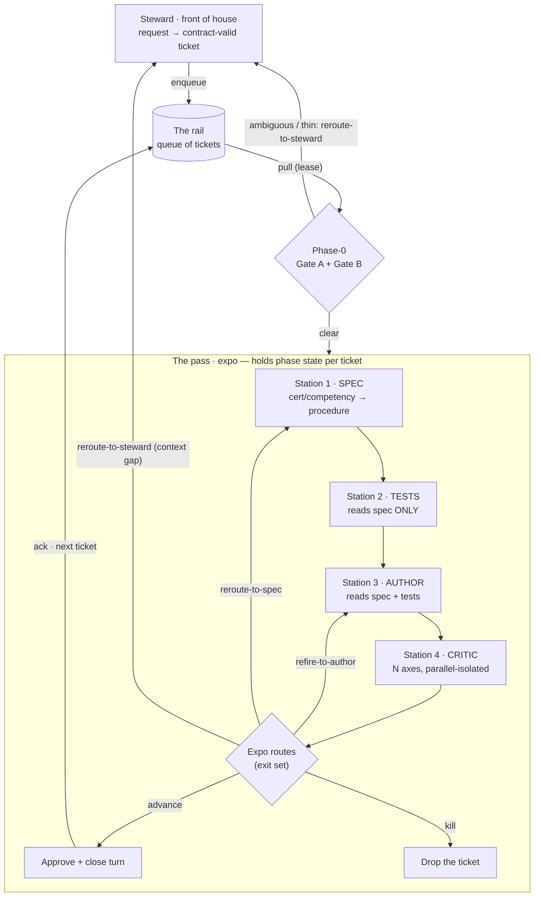
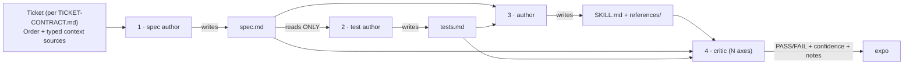
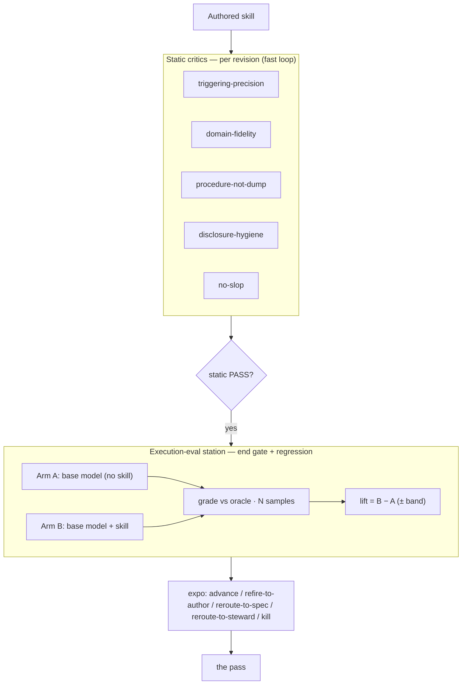

# ab-skill-factory

> Renamed from `skill-agent-brigade` (2026-07-09) to match the ab- brigade convention
> and the house. This is the factory brigade — the first agent brigade, and the one that
> builds the others. Deeper self-references in the spec docs (DESIGN, MENU-SPEC,
> ADAPTER-SPEC) and the functional internals (adapter, tests, mise engine, run.js) still
> carry the old name; those reconcile with the private house's `ab-skill-factory` as a
> follow-up, tracked with the public↔house alignment.

A **brigade for building skills** — a multi-agent assembly line that turns a one-line skill request plus a competency source into a well-tested, depth-forced `SKILL.md`, and gates slop out with independent critics before the skill ships. (Vocabulary: **station / the pass / expo / rail / ticket** — defined in [DESIGN.md → Naming (canonical)](./DESIGN.md).)

**The expo is the general per-brigade station coordinator** — it knows its brigade's station roster and decides which stations a ticket needs, in what order, plus a finishing touch. This factory's stations are the build stations (spec → tests → author → critic); a **discipline brigade** (e.g. [`ab-managerial-accounting`](../ab-managerial-accounting/), [`ab-data-engineering`](../ab-data-engineering/)) is the same shape with its own domain stations, and every brigade holds the same surface: **mise + expo + service + menu**. Going forward the factory should *emit* that shape when it assembles a discipline brigade, so consistency is generated, not hand-built.

It produces **two assets** every run:
1. **The brigade itself** (this plugin) — reusable across any skill you want to build.
2. **The worked-example output** — the authored skill + its full build trail (spec, tests, critic verdicts). The first stress test is `variance-analysis` (a Finance / managerial-accounting skill); see [`examples/variance-analysis/`](./examples/variance-analysis/) and the installed skill at [`../ab-managerial-accounting/skills/variance-analysis/`](../ab-managerial-accounting/skills/variance-analysis/).

## Why this shape

**Thin harness, fat skills.** A skill's value is the hard-won domain *procedure* baked into it, not the boilerplate. The slop-cannon failure mode is letting a model "flesh out" a skill from just its name — you get plausible-sounding, generic skills with no real depth. This brigade is built to **force depth in** (from a competency source) and **gate slop out** (via independent, adversarial critics).

## Architecture

> Port + handoff map (who stands on each side of every seam): [PORTS.md](./PORTS.md)
> Standard command surface every brigade exposes (menu · mise · service · fire · runner): [BRIGADE-INTERFACE.md](./BRIGADE-INTERFACE.md)

The **steward** (front of house) turns a request into a contract-valid ticket — gathering context from the **cellar**, the house knowledge store ([CELLAR-SPEC.md](./CELLAR-SPEC.md)) — and hangs it on the rail ([TICKET-CONTRACT.md](./TICKET-CONTRACT.md) is the port between them). The **expo** (the deciding agent at **the pass**) pulls tickets off the rail with a lease, gates each at **phase-0** (contract validity + context sufficiency — insufficient context exits `reroute-to-steward`), walks it through four stations, and owns a convergence loop: critic feedback routes back to the author (`refire-to-author`) or, for a spec-level gap, back to the spec station (`reroute-to-spec`); a passing verdict `advance`s the ticket and closes that turn. What a build produces lands back in the cellar, provenance-stamped — outputs compound into house knowledge.



### The four phases (and their contracts)

Each phase is a **separate sub-agent** that hands off through a **file artifact**, not shared context — this keeps each station focused and the test phase honestly independent of the implementation.



| Phase | Station | Reads | Writes | Job |
|---|---|---|---|---|
| 1 | **spec author** | the input record + competency excerpt | `spec.md` | Translate competency *knowledge* into an agent *procedure*: the steps the skill must encode, its trigger description, inputs/outputs, and a progressive-disclosure file plan. |
| 2 | **test author** | `spec.md` **only** | `tests.md` | Produce the acceptance contract — concrete scenarios, trigger-accuracy cases (should-fire vs deceptively-similar should-NOT-fire), and a fat-content check. Blind to implementation by design. |
| 3 | **author** | `spec.md` + `tests.md` (+ prior critic notes on a revision round) | `SKILL.md` + `references/` | Write the actual skill: a lean, trigger-tuned `SKILL.md` (the executable workflow) with depth pushed to reference files. |
| 4 | **critic** | the authored skill + `spec.md` + `tests.md` | verdict | Fan out one adversarial sub-agent per axis; aggregate to PASS/FAIL + confidence for the convergence loop. |

### The input contract

A skill-build request is a **ticket** — one canonical shape, defined in [TICKET-CONTRACT.md](./TICKET-CONTRACT.md). The rail is a queue of these:

```yaml
ticket: variance-analysis        # identity
artifact: skill                  # skill | brigade
context:                         # typed pointer sources — the depth source lives WHERE IT LIVES
  - { id: core-competency, type: file, ref: "…/core.md",            when: "always — the knowledge to proceduralize" }
  - { id: worked-examples, type: file, ref: "…/worked-examples.md", when: "always — the test station's oracle source" }
```
```markdown
## Order
Compute & interpret standard-costing variances — one computational Finance skill…
```

The **context sources** are the depth source. Certifications/BOKs encode what a practitioner *knows*; a skill encodes what they *do*. Phase 1 performs that knowledge → procedure translation. Transcribing a syllabus would be a knowledge dump; the brigade wants workflows. (The retired v1 shape — a 4-field `{name, purpose, context, competency_excerpt}` record — is recorded in the contract's Supersedes table.)

### The critic — and does it run the skill?

**Today (shipped): a static adversarial critic plus one deterministic lint axis.** Five LLM axes, each judged by an isolated sub-agent that defaults to FAIL unless the axis is clearly met:

- **triggering-precision** — fires on the right asks, not deceptively-similar wrong ones
- **domain-fidelity** — the procedure is actually *correct* against the competency source
- **procedure-not-knowledge-dump** — executable workflow steps, not a syllabus restatement
- **progressive-disclosure-hygiene** — lean `SKILL.md`, depth in reference files, lazy pointers
- **no-slop** — load-bearing specificity over plausible-generic filler

…and a sixth, **non-LLM** axis that runs in the same aggregation but *verifies* rather than *votes*:

- **skill-lint** *(deterministic)* — a programmatic pure-function check of the authored `SKILL.md` against eight hard rules from Anthropic's skill guide (filename `SKILL.md`; `name` kebab-case and matches the folder; no nested `README.md`; `name` free of "claude"/"anthropic"; `description` present and ≤ 1024 chars; no `<`/`>` in frontmatter; body < 5000 words; well-formed `allowed-tools`). Any rule FAIL is a hard gate — it cannot be out-voted by the LLM axes. See [DESIGN.md §5.0](./DESIGN.md) and `skillLint()` in the reference workflow.

**The stronger gate: the execution-eval station** (wired — see [`skills/execution-eval-station/`](./skills/execution-eval-station/) and [DESIGN.md §5](./DESIGN.md)). It doesn't just check the skill got the right answer — it measures whether the skill **beats the base model**. Same fixture, two arms (base model alone vs base model + skill), N samples each, both graded against the known answer. **Lift = with-skill pass-rate minus baseline.** Lift ≈ 0 means the skill is dead weight and the expo should kill the ticket; a positive lift that clears the noise band is the skill justifying its existence — and the number says *how much*. Because it executes the skill, needs N samples for variance, produces a measurement (not a vote), and must be re-runnable standalone for regression, it's its **own station, not a sixth critic axis**. Built on `skill-creator`'s benchmark machinery (two-arm runs, grader, `aggregate_benchmark` delta, analyzer lift-attribution); the fixtures are the acceptance contract's oracle set.



## The worked example: variance-analysis

The first stress test. The brigade produced a 59-line `SKILL.md` + five reference files in **one round** — **5/5 critic axes PASS** (triggering 0.78, domain-fidelity 0.95, procedure-not-dump 0.92, disclosure-hygiene 0.93, no-slop 0.90). The full verdicts are in [`examples/variance-analysis/critic-report.md`](./examples/variance-analysis/critic-report.md); the spec and tests that drove the build are alongside it.

The critic's one improvement note (ITERATE-grade, not a fail): a generic-FP&A near-miss carve-out lives in the skill body but not the description frontmatter — exactly the kind of precise feedback the convergence loop routes to the author on a revision round. It's preserved in the report rather than silently patched, to show the critic doing real work.

## Reference implementation

[`workflow/brigade-variance-analysis.run.js`](./workflow/brigade-variance-analysis.run.js) is the exact workflow as run (via the Claude Code Workflow tool) to produce the example — spec → tests → (author → critic)×rounds, with the 5 LLM axes fanned out in parallel, the deterministic `skillLint` axis in the same aggregation, and a max-2-round convergence loop. The station sub-agents read their station method from a local harness path on this run; their roles and contracts are fully documented in the table above (the station skills are being genericized for standalone publication — see Follow-ups).

## Building out more skills

Add a skill by appending its input record to the backlog and running the brigade. On a regular set (e.g. one skill per discipline), the **rail** fans the pass over the backlog — each ticket flows spec → tests → author → critic independently, so wall-clock is the slowest single ticket, not the sum. Installed skills accrue under per-discipline brigade plugins (e.g. [`../ab-managerial-accounting/`](../ab-managerial-accounting/), [`../ab-data-engineering/`](../ab-data-engineering/)) — each ships only eval-passers, plus a menu/router skill.

## Follow-ups

- **Execution-eval station** — *wired + measured across model tiers* ([`skills/execution-eval-station/`](./skills/execution-eval-station/), [`workflow/execution-eval-variance-analysis.run.js`](./workflow/execution-eval-variance-analysis.run.js), result in [`examples/variance-analysis/execution-eval-report.md`](./examples/variance-analysis/execution-eval-report.md)). The skill brings every tier (Haiku/Sonnet/Opus) to a deterministic 100%; base models already ceiling the *computational* fixtures (A/B/C → 0 lift), so all lift lives in the *judgment* fixture D and grows as the base model weakens (**Sonnet +33 pp, Haiku +22 pp on D**). Surfaced design lesson: the aggregate mean diluted this to a mechanical `kill` — the expo must consume **per-fixture** lift, not the aggregate. Remaining: have the expo weight/prune fixtures by discrimination; persist regression baselines to the rail; consume per-fixture lift as the advance/kill/refire decision.
- **Station genericization** — publish the four station skills as standalone, environment-portable files (the canonical versions currently reference an internal harness layout).
- **Expo as a first-class loop** — see [`skills/expo/`](./skills/expo/) for the backlog-loop + phase-state + feedback-routing contract.
