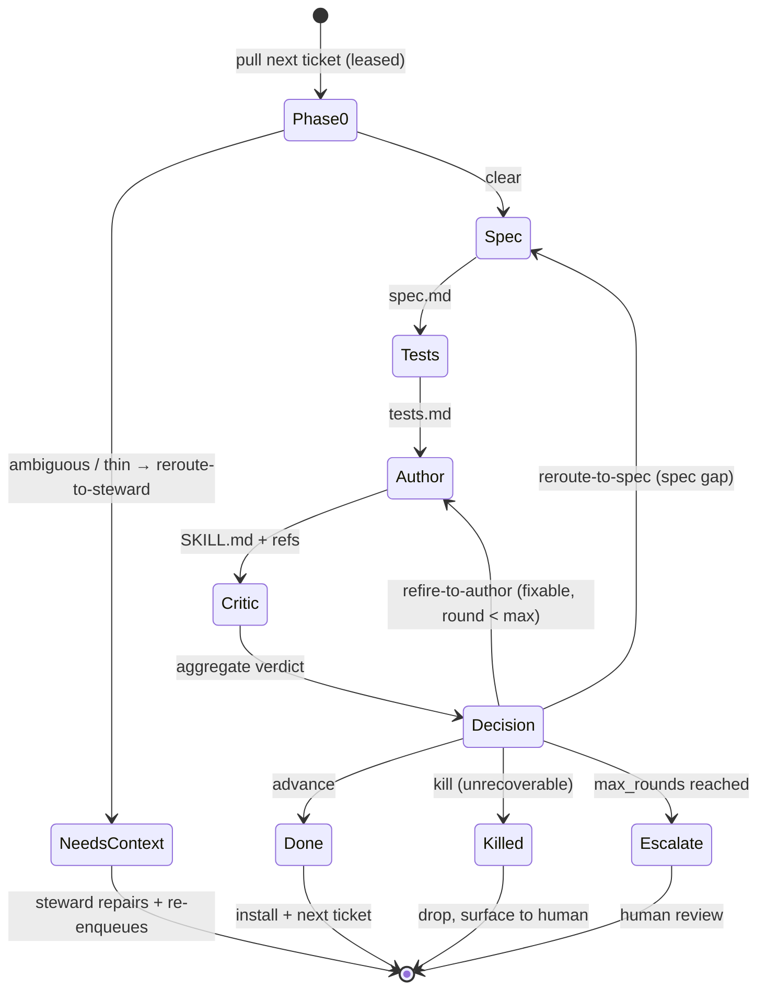

# Expo

The deciding agent at **the pass** — the layer of the brigade that runs one ticket through the stations. The four stations (spec, test, author, critic) each do one job; the expo is what makes them a *loop* — it owns sequencing, phase state, the convergence (exit-set) decision, and the backlog walk. Its authority rests on an information advantage the single-shot critic lacks: it holds phase state, ticket history, and cross-station context.

The expo routes every ticket using one closed **exit set**: `advance · refire-to-author · reroute-to-spec · reroute-to-steward · kill`. (`escalate` on `max_rounds` is a budget stop that hands the ticket to a human — a pause awaiting a human's exit call, not a sixth exit.) `reroute-to-steward` closes the front-end loop: when the *context* is the problem rather than the build, the ticket goes back to the [steward](../steward/) as `needs-context`.

## Inputs

- **Backlog** — the **rail** of tickets, pulled via `pull(worker)` with a lease ([RAIL-SPEC.md](../../RAIL-SPEC.md)). Each ticket conforms to [TICKET-CONTRACT.md](../../TICKET-CONTRACT.md): frontmatter identity + typed context sources, `## Order`, snapshot, work log, artifacts. (The v1 4-field record `{name, purpose, context, competency_excerpt}` is retired — those fields now live in the contract as `ticket`, `## Order`, and `context:` sources.)
- **Per-run dir** — a scratch directory per ticket where the station artifacts (`spec.md`, `tests.md`, `SKILL.md` + `references/`) are written and handed off.
- **`max_rounds`** — convergence cap (default 2): how many author↔critic revision rounds before the expo escalates instead of looping forever.

## The loop

For each ticket pulled off the backlog:

0. **Phase-0 — the two-gate entry** ([criteria in TICKET-CONTRACT.md](../../TICKET-CONTRACT.md)). (If `artifact: menu`, skip the stations entirely — see **Menu tickets** below.) **Gate A** (deterministic): re-run `ticketLint()` at pull — a failure here should have been impossible past the steward's enqueue check, so park `needs-context` AND flag the adapter defect. **Gate B** (judgment): read the Order + eager sources, render **Clear** (proceed) / **Ambiguous** (append the question, exit `reroute-to-steward`) / **Thin** (append the itemized specify-missing list, exit `reroute-to-steward`). Only Clear tickets enter the stations.
1. **Station 1 — Spec.** Run the spec author on the ticket's Order + resolved context. Output: `spec.md`. State = `spec_done`.
2. **Station 2 — Tests.** Run the test author on `spec.md` **only**. Output: `tests.md`. State = `tests_done`.
3. **Station 3 — Author.** Run the author on `spec.md` + `tests.md` (+ accumulated critic notes on a revision round). Output: `SKILL.md` + `references/`. State = `authored`.
4. **Station 4 — Critic.** Fan out one sub-agent per LLM critic axis (parallel, isolated) and run the deterministic `skill-lint` axis. Aggregate verdicts to PASS/FAIL + confidence. State = `judged`.
5. **Route the ticket on the exit set:**
   - **`advance`** (no high-confidence FAIL, lint clean) → **approve + close** this ticket's turn. Install the skill, archive the run dir, pull the next ticket.
   - **`refire-to-author`** (FAIL fixable in the draft) → accumulate the critic's actionable notes, return to **Station 3** (author), `round += 1`.
   - **`reroute-to-spec`** (spec-level gap — the acceptance contract itself is wrong/incomplete, not just the draft) → return to **Station 1** (spec) with the gap noted.
   - **`reroute-to-steward`** (the *context* is the problem — phase-0 Ambiguous/Thin, or a station discovered the payload can't support the acceptance contract) → append exactly what's missing/contradictory to the work log, `ack(needs-context)`; the steward repairs and re-enqueues.
   - **`kill`** (the skill is unrecoverable / dead weight — e.g. execution-eval shows zero lift on every fixture that has headroom) → drop the ticket; surface the per-fixture table for the human to confirm.
   - **`max_rounds` reached without `advance`** → stop looping. **Escalate to a human** with the latest draft, the verdicts, and the open notes — do not silently ship a failing skill or burn unbounded rounds.

## Menu tickets (discovery)

A ticket with `artifact: menu` is a steward asking "what can your brigade do?" ([MENU-SPEC.md](../../MENU-SPEC.md)). The expo answers it itself — no stations: **introspect the brigade** (stations on the roster, critic axes + deterministic gates, eval config, artifact types offered, per-type payload requirements), write/refresh the menu at `<cellar>/brigades/<brigade>/menu.md` (bump `version`), record the path in the ticket's Artifacts section, and ack `advance`. Re-answering after the brigade changes is how menus stay versioned.

## Per-type handling (menu v3 artifact types)

- **`add-station`** — runs the normal four-station line on the station-as-skill, then on `advance` the expo ALSO executes the wiring the order names: update the target brigade's roster (README table), re-publish its menu with a version bump, and register the new artifact kind → station callable in that brigade's walk registry. The wiring is part of the advance, not a follow-up — an unwired station is not done. Precedent: the sec-filings station (2026-07-02), where the wiring was manual and the critic gates ran retroactively; this type exists to front-load both.
- **`iterate-skill`** — after the critic passes the refined skill, the expo MUST run the execution-eval station two-arm (current skill vs refined, per-fixture, per-tier — the 2026-06-29 machinery) before deciding. `advance` requires: the targeted axis improves AND no other fixture regresses. Anything else → refire-to-author with the per-fixture table in the work log, or kill with the honest "refinement didn't beat baseline" note. No eval run = no advance, ever.
- **`iterate-brigade`** — NOT live (menu: planned). Do not accept these tickets until the replay-eval (closed tickets re-run against the changed policy) exists; Gate A's menu check enforces this mechanically.

## Responsibilities (what the expo owns vs delegates)

- **Owns:** phase-0 (both gates), station sequencing, per-ticket phase state, the exit-set decision (advance / refire-to-author / reroute-to-spec / reroute-to-steward / kill, or escalate-pause), the backlog walk (`pull`/`ack`/`release` against the rail), the `max_rounds` budget, and run-dir lifecycle (create → archive on close).
- **Delegates:** the actual spec/test/author/critic work to the four stations, and context repair to the steward. The expo never authors content, gathers context, or judges an axis itself — it routes.

## Batch / fan-out (the rail)

On a regular backlog (e.g. one skill per discipline), the **rail** fans the pass over the tickets: each ticket flows through all four stations independently, with no barrier between tickets, so wall-clock is the slowest single ticket rather than the sum. Keep the convergence loop per-ticket; the backlog walk is the only shared state.

## Honest defaults

- Never report a skill as shipped that didn't pass — surface the verdict as-is.
- Cap rounds; escalate on stall rather than loop.
- Keep the test phase blind to the implementation — never let author output leak back into the test author's inputs.
