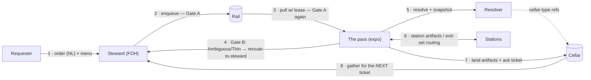

# Ports & Handoffs — the Hexagonal Map

One page that owns the seam map: every port the brigade core exposes, who stands on each side of it, and what crosses at each handoff. Detail lives in the per-port specs; this doc is the index and the walk-through.

## The four ports

The core (stations + the pass) talks only to interfaces, never to a technology:

| port | spec | what crosses it | driving side | driven side |
|---|---|---|---|---|
| **ticket contract** | [TICKET-CONTRACT.md](./TICKET-CONTRACT.md) | the unit of work (order → build record) | steward, human hand-authoring | — (the contract is the artifact itself) |
| **rail** | [RAIL-SPEC.md](./RAIL-SPEC.md) | ticket storage + queue semantics (`enqueue · pull-with-lease · ack · release · read · append · list`) | steward (enqueue), the pass (pull/ack) | Obsidian vault (v1) · Snowflake Stage · Cortex Search |
| **resolver** | [BUNDLE-SPEC.md](./BUNDLE-SPEC.md) | context bytes on demand, by source type | the pass (at build time) | `file` · `url` · `mcp` · `qmd` · `cellar` (· `graph` future) |
| **cellar** | [CELLAR-SPEC.md](./CELLAR-SPEC.md) | durable knowledge (`land · resolve · search · list`) | brigades (land), steward (gather) | filesystem/vault (v1) · Google Drive · S3 · Snowflake Stage |

Menus ([MENU-SPEC.md](./MENU-SPEC.md)) are not a fifth port — a menu is a *payload standard* published over the rail: per-brigade content riding the universal envelope.

## The handoff chain

| # | seam | what crosses | enforced by |
|---|---|---|---|
| 1 | **requester → steward** | the ask, in the requester's terms; steward pairs it to the target brigade's **menu** and clarifies ambiguity *now* (cheapest gate) | steward procedure — nothing ambiguous gets written down |
| 2 | **steward → rail** (enqueue) | a contract-valid ticket: inline typed-context manifest + `## Order`; subject identity already canonical (cellar key resolved at intake) | **Gate A** — `ticketLint()`, 8 deterministic rules, steward-side |
| 3 | **rail → the pass** (pull) | the ticket, under a lease (`worker, at, ttl_min`); expired leases reclaimable | rail interface; **Gate A re-run expo-side** — a ticket that passes one side and fails the other exposes a mutating adapter |
| 4 | **the pass → steward** (reroute-to-steward) | phase-0 **Gate B** verdict: Ambiguous (a question) or Thin (itemized specify-missing list), appended to the work log; steward repairs *exactly what's itemized*, re-enqueues | Gate B written criteria; 3-bounce budget, then back to the requester |
| 5 | **ticket → resolver** | each `context:` source, dispatched by type; live sources (`url`/`mcp`/`qmd`) **resolved-and-snapshotted** into the ticket so the build is replayable | resolver interface; snapshot section is append-only |
| 6 | **stations ↔ the pass** | file artifacts (spec.md → tests.md → skill → verdicts); critic **advises**, expo **decides** via the closed exit set `advance · refire-to-author · reroute-to-spec · reroute-to-steward · kill` (escalate = pause, not an exit) | the pass owns routing; stations never talk to each other directly |
| 7 | **brigade → cellar** (land) | every produced artifact, provenance-stamped (`produced_by: {brigade, ticket, station}`); the ticket's `## Artifacts` section records the cellar refs, then the ticket is acked | **`cellarLint()`** at land-time; append-only, supersedes-chains |
| 8 | **cellar → steward** (gather) | context for the *next* ticket: `search`/`list` over what the house already landed — outputs compound into inputs | steward's cellar-first sourcing rule; canonical subject keys make the lookup deterministic |

## The two loops the seams close

- **Front-end (context) loop:** seam 4 → seam 2. The expo's Gate B routes insufficient context back to the steward, who repairs and re-enqueues — mirror of the back-end critic loop, budgeted the same way.
- **Back-end (build) loop:** seam 6. Critic feedback refires the author (or reroutes to spec); a passing verdict advances.

And the long loop that makes the whole thing compound: seam 7 → seam 8 — one brigade's landed output is the next ticket's gathered context. In the multi-brigade topology (N stewards ↔ M brigades over shared rails), that seam is *between brigades*: a research brigade lands company context that an engagement brigade's ticket later points at.

## Discovery (menus over the rail — no extra machinery)

A steward that doesn't know a brigade's requirements hangs an `artifact: menu` ticket (seam 2); the expo answers it by introspection instead of running stations, publishing to `<rail>/menus/<brigade>.menu.md` (seam 7, in spirit). Versioned by re-answering on brigade change. Same envelope, same gates.

## Deployment note — domain ports

A deployment of this pattern will grow **domain ports** of its own at its system boundaries — typed, versioned artifact schemas between a brigade and a downstream consumer (the same move as seam 2's contract, applied to a domain artifact). Those belong in the deployment's repo, not here: define them as JSON Schema with both-sides validation, and keep the two-fidelity question (estimate-tolerant view vs delivery-precise view) explicit per field.
