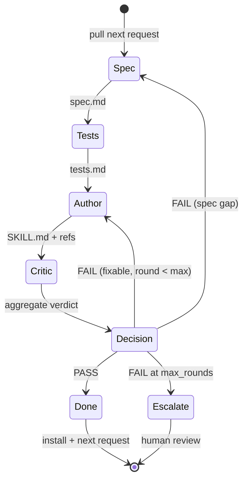

# Skill-Dev Orchestrator

The outer layer of the skill-development pipeline. The four seats (spec, test, author, critic) each do one job; the orchestrator is what makes them a *loop* — it owns sequencing, phase state, the convergence decision, and the backlog walk.

## Inputs

- **Backlog** — an ordered list of skill-build requests. Each request is the 4-field input record: `{ name, purpose, context, competency_excerpt }`.
- **Per-run dir** — a scratch directory per skill where the phase artifacts (`spec.md`, `tests.md`, `SKILL.md` + `references/`) are written and handed off.
- **`max_rounds`** — convergence cap (default 2): how many author↔critic revision rounds before the orchestrator escalates instead of looping forever.

## The loop

For each request pulled off the backlog:

1. **Phase 1 — Spec.** Run the spec author on the input record. Output: `spec.md`. State = `spec_done`.
2. **Phase 2 — Tests.** Run the test author on `spec.md` **only**. Output: `tests.md`. State = `tests_done`.
3. **Phase 3 — Author.** Run the author on `spec.md` + `tests.md` (+ accumulated critic notes on a revision round). Output: `SKILL.md` + `references/`. State = `authored`.
4. **Phase 4 — Critic.** Fan out one sub-agent per critic axis (parallel, isolated). Aggregate verdicts to PASS/FAIL + confidence. State = `judged`.
5. **Route on the verdict:**
   - **PASS** (no high-confidence FAIL) → **approve + close** this skill's turn. Install the skill, archive the run dir, pull the next request.
   - **FAIL, fixable in the draft** → accumulate the critic's actionable notes, return to **Phase 3** (author), `round += 1`.
   - **FAIL, spec-level gap** (the acceptance contract itself is wrong/incomplete, not just the draft) → return to **Phase 1** (spec) with the gap noted.
   - **FAIL at `max_rounds`** → stop looping. **Escalate to a human** with the latest draft, the verdicts, and the open notes — do not silently ship a failing skill or burn unbounded rounds.

## Responsibilities (what the orchestrator owns vs delegates)

- **Owns:** phase sequencing, per-skill phase state, the convergence decision (route feedback / approve / escalate), the backlog walk, the `max_rounds` budget, and run-dir lifecycle (create → archive on close).
- **Delegates:** the actual spec/test/author/critic work to the four seats. The orchestrator never authors content or judges an axis itself — it routes.

## Batch / fan-out

On a regular backlog (e.g. one skill per discipline), run the requests as a fan-out: each skill flows through all four phases independently, with no barrier between skills, so wall-clock is the slowest single skill rather than the sum. Keep the convergence loop per-skill; the backlog walk is the only shared state.

## Honest defaults

- Never report a skill as shipped that didn't pass — surface the verdict as-is.
- Cap rounds; escalate on stall rather than loop.
- Keep the test phase blind to the implementation — never let author output leak back into the test author's inputs.
