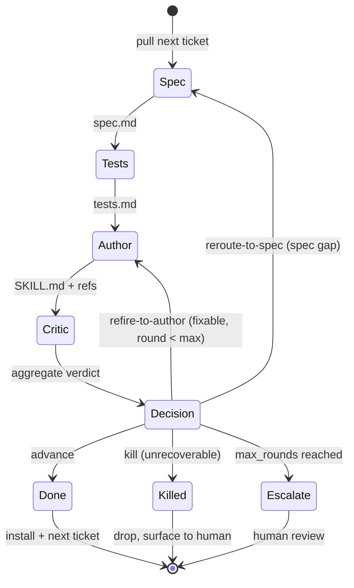

# Expo

The deciding agent at **the pass** — the layer of the brigade that runs one ticket through the stations. The four stations (spec, test, author, critic) each do one job; the expo is what makes them a *loop* — it owns sequencing, phase state, the convergence (exit-set) decision, and the backlog walk. Its authority rests on an information advantage the single-shot critic lacks: it holds phase state, ticket history, and cross-station context.

The expo routes every ticket using one closed **exit set**: `advance · refire-to-author · reroute-to-spec · kill`.

## Inputs

- **Backlog** — an ordered list of skill-build tickets (the **rail**). Each ticket is the 4-field input record: `{ name, purpose, context, competency_excerpt }`.
- **Per-run dir** — a scratch directory per ticket where the station artifacts (`spec.md`, `tests.md`, `SKILL.md` + `references/`) are written and handed off.
- **`max_rounds`** — convergence cap (default 2): how many author↔critic revision rounds before the expo escalates instead of looping forever.

## The loop

For each ticket pulled off the backlog:

1. **Station 1 — Spec.** Run the spec author on the input record. Output: `spec.md`. State = `spec_done`.
2. **Station 2 — Tests.** Run the test author on `spec.md` **only**. Output: `tests.md`. State = `tests_done`.
3. **Station 3 — Author.** Run the author on `spec.md` + `tests.md` (+ accumulated critic notes on a revision round). Output: `SKILL.md` + `references/`. State = `authored`.
4. **Station 4 — Critic.** Fan out one sub-agent per LLM critic axis (parallel, isolated) and run the deterministic `skill-lint` axis. Aggregate verdicts to PASS/FAIL + confidence. State = `judged`.
5. **Route the ticket on the exit set:**
   - **`advance`** (no high-confidence FAIL, lint clean) → **approve + close** this ticket's turn. Install the skill, archive the run dir, pull the next ticket.
   - **`refire-to-author`** (FAIL fixable in the draft) → accumulate the critic's actionable notes, return to **Station 3** (author), `round += 1`.
   - **`reroute-to-spec`** (spec-level gap — the acceptance contract itself is wrong/incomplete, not just the draft) → return to **Station 1** (spec) with the gap noted.
   - **`kill`** (the skill is unrecoverable / dead weight — e.g. execution-eval shows zero lift on every fixture that has headroom) → drop the ticket; surface the per-fixture table for the human to confirm.
   - **`max_rounds` reached without `advance`** → stop looping. **Escalate to a human** with the latest draft, the verdicts, and the open notes — do not silently ship a failing skill or burn unbounded rounds.

## Responsibilities (what the expo owns vs delegates)

- **Owns:** station sequencing, per-ticket phase state, the exit-set decision (advance / refire-to-author / reroute-to-spec / kill, or escalate), the backlog walk, the `max_rounds` budget, and run-dir lifecycle (create → archive on close).
- **Delegates:** the actual spec/test/author/critic work to the four stations. The expo never authors content or judges an axis itself — it routes.

## Batch / fan-out (the rail)

On a regular backlog (e.g. one skill per discipline), the **rail** fans the pass over the tickets: each ticket flows through all four stations independently, with no barrier between tickets, so wall-clock is the slowest single ticket rather than the sum. Keep the convergence loop per-ticket; the backlog walk is the only shared state.

## Honest defaults

- Never report a skill as shipped that didn't pass — surface the verdict as-is.
- Cap rounds; escalate on stall rather than loop.
- Keep the test phase blind to the implementation — never let author output leak back into the test author's inputs.
