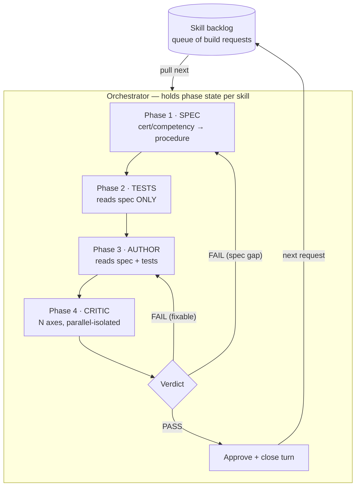
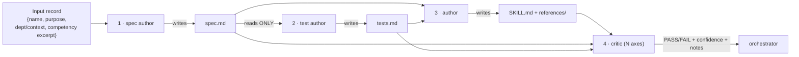
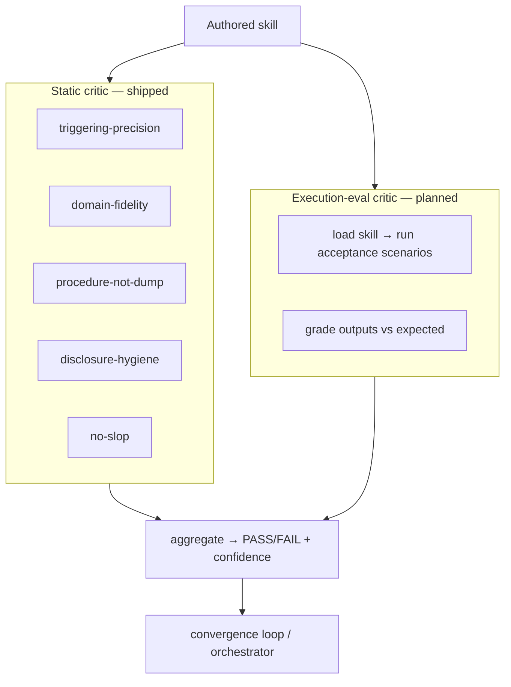

# skill-dev-pipeline

A **meta-pipeline for building skills** — a multi-agent assembly line that turns a one-line skill request plus a competency source into a well-tested, depth-forced `SKILL.md`, and gates slop out with independent critics before the skill ships.

It produces **two assets** every run:
1. **The pipeline itself** (this plugin) — reusable across any skill you want to build.
2. **The worked-example output** — the authored skill + its full build trail (spec, tests, critic verdicts). The first stress test is `variance-analysis` (a Finance / managerial-accounting skill); see [`examples/variance-analysis/`](./examples/variance-analysis/) and the installed skill at [`../discipline-skills/skills/variance-analysis/`](../discipline-skills/skills/variance-analysis/).

## Why this shape

**Thin harness, fat skills.** A skill's value is the hard-won domain *procedure* baked into it, not the boilerplate. The slop-cannon failure mode is letting a model "flesh out" a skill from just its name — you get plausible-sounding, generic skills with no real depth. This pipeline is built to **force depth in** (from a competency source) and **gate slop out** (via independent, adversarial critics).

## Architecture

An **orchestrator** pulls skill-build requests off a backlog one at a time, walks each through four phases, and owns a convergence loop: critic feedback routes back to the author (or, for a spec-level gap, back to the spec phase), and a passing verdict approves the skill and closes that turn.



### The four phases (and their contracts)

Each phase is a **separate sub-agent** that hands off through a **file artifact**, not shared context — this keeps each seat focused and the test phase honestly independent of the implementation.



| Phase | Seat | Reads | Writes | Job |
|---|---|---|---|---|
| 1 | **spec author** | the input record + competency excerpt | `spec.md` | Translate competency *knowledge* into an agent *procedure*: the steps the skill must encode, its trigger description, inputs/outputs, and a progressive-disclosure file plan. |
| 2 | **test author** | `spec.md` **only** | `tests.md` | Produce the acceptance contract — concrete scenarios, trigger-accuracy cases (should-fire vs deceptively-similar should-NOT-fire), and a fat-content check. Blind to implementation by design. |
| 3 | **author** | `spec.md` + `tests.md` (+ prior critic notes on a revision round) | `SKILL.md` + `references/` | Write the actual skill: a lean, trigger-tuned `SKILL.md` (the executable workflow) with depth pushed to reference files. |
| 4 | **critic** | the authored skill + `spec.md` + `tests.md` | verdict | Fan out one adversarial sub-agent per axis; aggregate to PASS/FAIL + confidence for the convergence loop. |

### The input contract

A skill-build request is a 4-field record. The backlog is just a list of these:

```
{ name:               "variance-analysis",
  purpose:            "compute & interpret standard-costing variances",
  context:            "Finance",
  competency_excerpt: "<the body-of-knowledge the skill must encode as a procedure>" }
```

The **competency excerpt** is the depth source. Certifications/BOKs encode what a practitioner *knows*; a skill encodes what they *do*. Phase 1 performs that knowledge → procedure translation. Transcribing a syllabus would be a knowledge dump; the pipeline wants workflows.

### The critic — and does it run the skill?

**Today (shipped): a static adversarial critic.** Five axes, each judged by an isolated sub-agent that defaults to FAIL unless the axis is clearly met:

- **triggering-precision** — fires on the right asks, not deceptively-similar wrong ones
- **domain-fidelity** — the procedure is actually *correct* against the competency source
- **procedure-not-knowledge-dump** — executable workflow steps, not a syllabus restatement
- **progressive-disclosure-hygiene** — lean `SKILL.md`, depth in reference files, lazy pointers
- **no-slop** — load-bearing specificity over plausible-generic filler

**Planned (the stronger gate): an execution-eval critic** that actually *runs* the authored skill on the acceptance scenarios and grades the output against expected results — empirical performance, not just static review. For `variance-analysis` that means feeding the skill a real actual-vs-standard dataset and checking it decomposes the variances correctly. Static review catches structural and fidelity problems; execution-eval catches behavioral ones. The two run together.



## The worked example: variance-analysis

The first stress test. The pipeline produced a 59-line `SKILL.md` + five reference files in **one round** — **5/5 critic axes PASS** (triggering 0.78, domain-fidelity 0.95, procedure-not-dump 0.92, disclosure-hygiene 0.93, no-slop 0.90). The full verdicts are in [`examples/variance-analysis/critic-report.md`](./examples/variance-analysis/critic-report.md); the spec and tests that drove the build are alongside it.

The critic's one improvement note (ITERATE-grade, not a fail): a generic-FP&A near-miss carve-out lives in the skill body but not the description frontmatter — exactly the kind of precise feedback the convergence loop routes to the author on a revision round. It's preserved in the report rather than silently patched, to show the critic doing real work.

## Reference implementation

[`workflow/skill-pipeline-variance-analysis.run.js`](./workflow/skill-pipeline-variance-analysis.run.js) is the exact workflow as run (via the Claude Code Workflow tool) to produce the example — spec → tests → (author → critic)×rounds, with the 5 axes fanned out in parallel and a max-2-round convergence loop. The seat sub-agents read their seat method from a local harness path on this run; their roles and contracts are fully documented in the table above (the seat skills are being genericized for standalone publication — see Follow-ups).

## Building out more skills

Add a skill by appending its input record to the backlog and running the pipeline. On a regular set (e.g. one skill per discipline), the orchestrator runs them as a fan-out — each skill flows spec → tests → author → critic independently, so wall-clock is the slowest single skill, not the sum. Installed skills accrue under [`../discipline-skills/`](../discipline-skills/).

## Follow-ups

- **Execution-eval critic** — wire the run-the-skill-against-the-acceptance-scenarios gate described above.
- **Seat genericization** — publish the four seat skills as standalone, environment-portable files (the canonical versions currently reference an internal harness layout).
- **Orchestrator as a first-class loop** — see [`skills/skill-dev-orchestrator/`](./skills/skill-dev-orchestrator/) for the backlog-loop + phase-state + feedback-routing contract.
